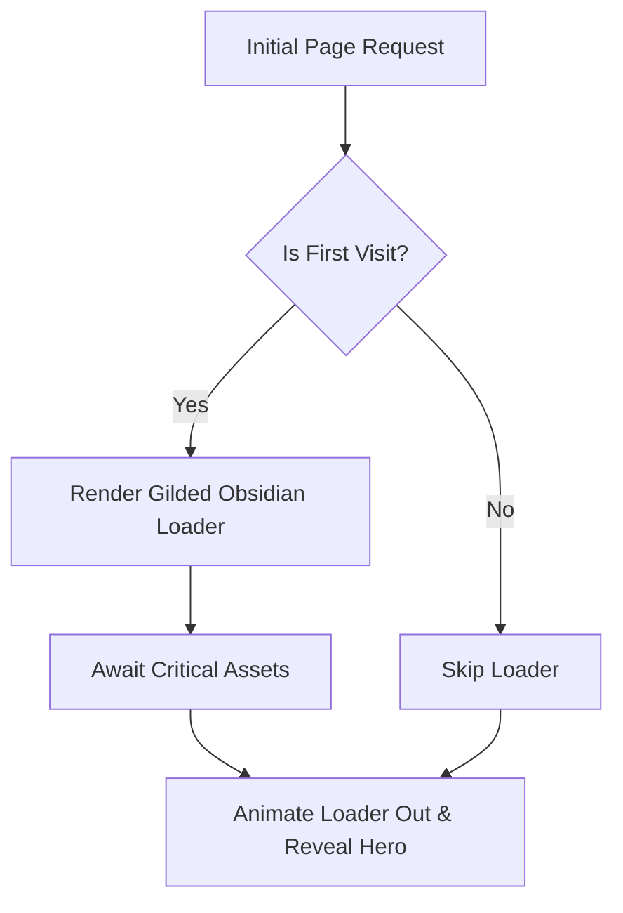
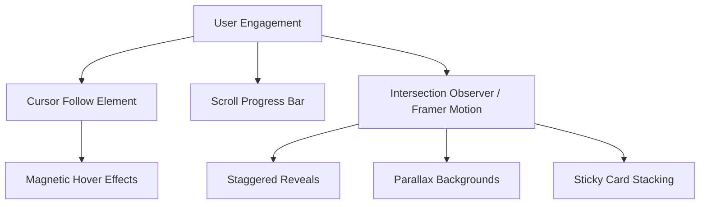
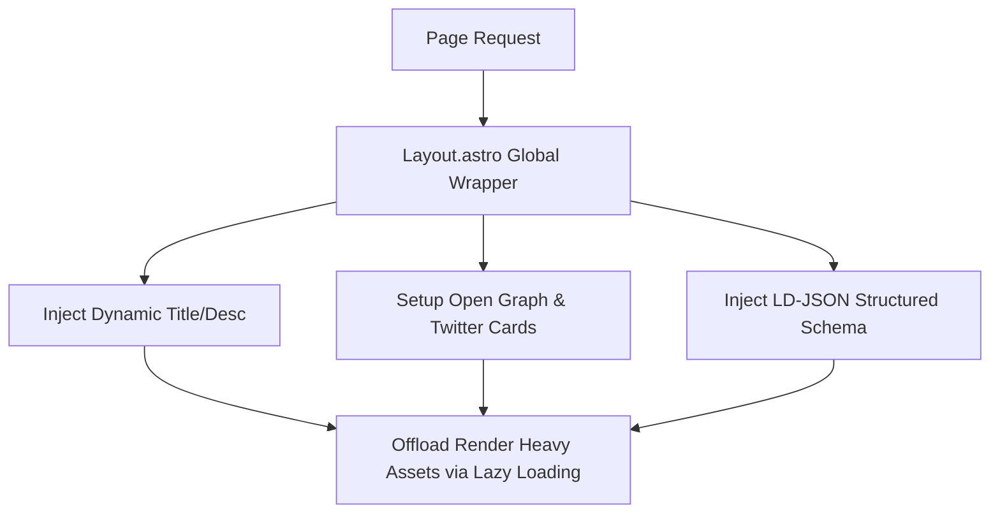

# Maati Art Cafe

  
  
  
  
  

An immersive, highly animated premium cafe website built with Astro and React. The architecture focuses on deep, cinematic storytelling with performant scroll-linked animations and a robust, modern aesthetic.

---

## Way of Working (Logic Flows)

### Loading & Entry Flow

### Scroll & Interaction Flow

### SEO & Performance Pipeline

---

## Exhaustive File Table

### Project Root
| File/Directory | Purpose |
|----------------|---------|
| `astro.config.mjs` | Primary configuration for the Astro framework, including React and Tailwind integrations, prefetching rules, and vite build/css-splitting config. |
| `.vscode/settings.json` | VS Code workspace overrides specifically to mute standard CSS linting against modern Tailwind CSS v4 directives (e.g. `@theme`, `@import source`). |
| `postcss.config.mjs` | PostCSS configuration handling CSS transforms and Tailwind utility compilation. |
| `tailwind.config.ts` / `.css`| Theme definitions, custom color palettes (`--espresso`, `--cream`, etc.), and breakpoints. |
| `package.json` | Project dependencies including `lucide-react`, `motion/react`, and other UI utilities. |

### Source (`/src`)
| Path / File | Purpose |
|-------------|---------|
| `/pages/*.astro` | Core Astro routes: `index.astro`, `about.astro`, `gallery.astro`, `menu.astro`. |
| `/layouts/Layout.astro` | The global wrapper component managing the document shell (`<head>`, `<meta>`), maintaining global state (e.g. Navigation & Cursor persistence across routes). |
| `/styles/` | Global CSS configuration: `theme.css` (custom design variables), `globals.css` (base layer resets/themes). |

### Components (`/src/components`)
| Component | Description |
|-----------|-------------|
| **`/pages/`** | Contains the heavy React logic for each major page route. |
| ↳ `Home.tsx` | Sticky-stacked scroll layout featuring parallax hero, floating coffee particles, and zoom-out responsive scaling. |
| ↳ `About.tsx` | Cinematic origin story layout divided by Earth, Craft, Fire, and Ritual philosophies. |
| ↳ `Menu.tsx` / `Gallery.tsx` | Grid-based media displays with hover reveals. |
| **Global UI** | Shared interactive elements for the main layout shell. |
| ↳ `Navigation.tsx` | Highly polished drawer & fixed header with Framer Motion entry animations. |
| ↳ `Footer.tsx` | Global site footer with branding and links. |
| ↳ `LoadingScreen.tsx` | "Gilded Obsidian" asset-aware introductory blocker to mask FOUC/flashes. |
| ↳ `CursorFollow.tsx` | Custom magnetic, dynamic pointer. |
| ↳ `FloatingParticles.tsx`| Performs background particle animation using React/Framer. |
| **`/ui/`** | The complete raw shadcn/ui library components (`button.tsx`, `dialog.tsx`, `accordion.tsx`, etc.). |
| **`/figma/`** | Helper components including `ImageWithFallback` for robust asset rendering. |

---

## Design System Overview

- **Aesthetic**: Premium, earthy, and highly sophisticated.
- **Color Tokens**:
  - `--espresso`: Deep dark brownish-black (`#2C1810`).
  - `--cream`: Primary background (`#FFF8F0`).
  - `--mocha`, `caramel`, `latte`: For accent borders, glow effects, gradients, and secondary UI highlights.
- **Typography**: Heavily relies on `font-serif` for elegant, editorial headings coupled with clean, tracked-out sans serif uppercase labels.
- **Interactivity**: Everything feels tactile. Extensive use of `group-hover:opacity-100` coupled with Framer Motion's `whileHover` and `useScroll` hooks ensures no element feels static.